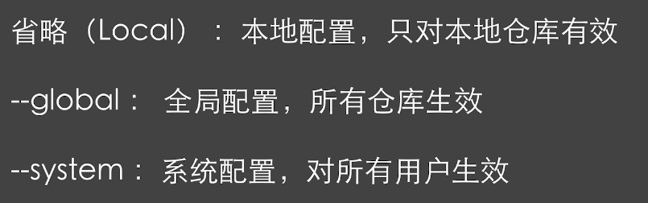
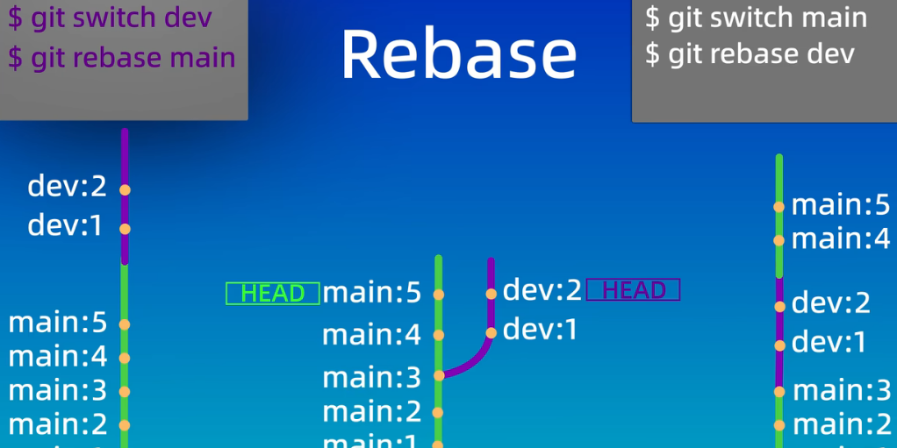
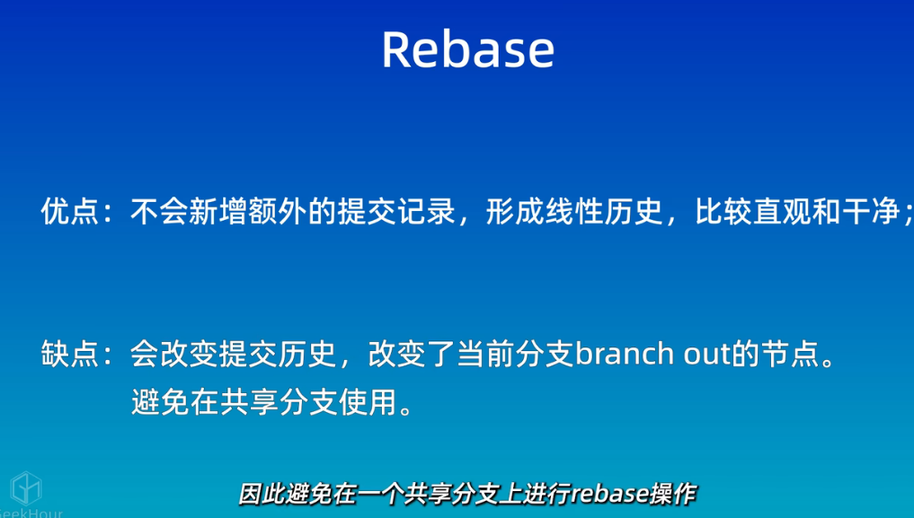
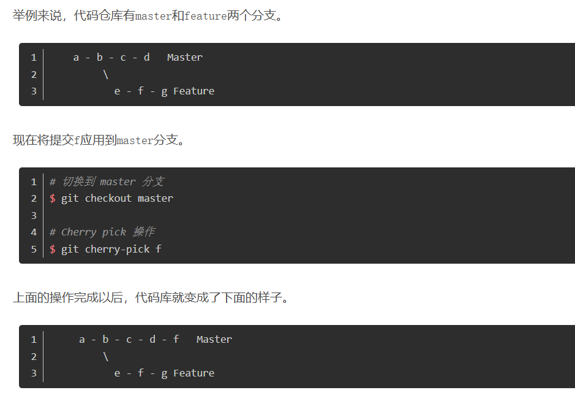
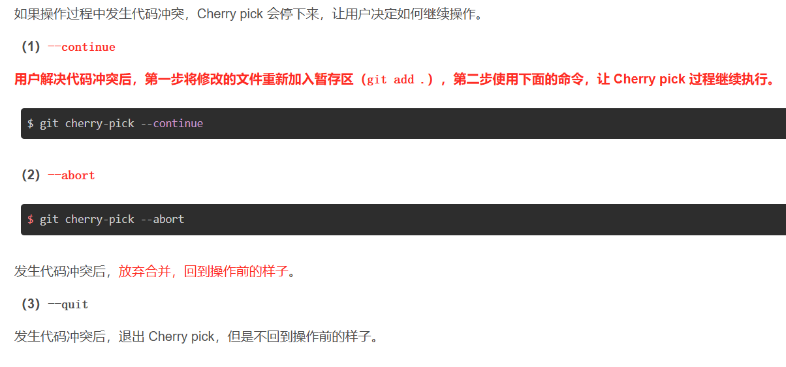

**Git 是一个免费的开源分布式版本控制系统，旨在处理从小型到 快速高效的超大型项目。**

<h4 id="Pqf5c">Git的安装</h4>

git官网:[Git](https://git-scm.com/)

:::tips
// 查看git版本

git -v

初次使用git需要配置用户名和邮箱

git config --global user.name "Jasper Yang'

git config --global user.email geekhall.cn@gmail.com

查看配置的信息

git config --global --list

:::

<h4 id="fTdbq">Git的使用</h4>
<h5 id="JOa9i">新建仓库</h5>

:::tips
方式一 : git init     //本地初始化仓库

方式二 : git clone  //远程克隆仓库

:::

<h5 id="hFwcB">工作区域和文件状态</h5>

工作区域

文件状态

未跟踪:新创建的,未被git管理的文件

未修改:已被git管理,文件内容未被修改的文件

已修改:已修改,未被添加到暂存区的文件

已暂存::已被添加到暂存区的文件

<h5 id="APnI7">添加和提交文件</h5>

:::tips
git init       创建仓库

git status   查看仓库

git add       添加到暂存区

git commit 提交

git log        查看历史提交记录

:::

<h5 id="iWAqB">git reset 回退版本</h5>

git reset

:::tips
ls 查看工作区所有文件

ls -a 查看工作区所有文件(包括隐藏文件)

git ls-liles 查看暂存区所有文件

:::

:::tips
谨慎使用 --hard 会删除两个版本之间的工作区和暂存区

若误操作删除,可以使用git reflog 查看操作的历史记录,然后使用git reset 回退到误操作前的版本

:::

<h5 id="PxRXz">git diff</h5>

git diff

:::tips
//  HEAD 指向分支的最新提交节点

git diff    默认查看工作区和暂存区的差异

git diff HEAD  查看工作区和版本库的差异

git diff --cached 查看暂存区和版本库的差异

git diff <ID> <ID> 查看两次版本库的差异

git diff <ID> <ID> <flie> 查看两次版本库中某个文件的差异

:::

<h5 id="zUsvn">git rm</h5>

git rm

<h5 id="nJvyJ">.gitignore</h5>

.gitignore

Git官网匹配规则:[Git - gitignore Documentation](https://git-scm.com/docs/gitignore)

<h5 id="uMZob">远程仓库</h5>

不存在本地仓库

echo&quot;# remote-repo&quot;&gt;&gt; README.md

git init

git add README.md

git commit -m&quot;first commit&quot;

git branch - main

git remote add origin git@github.com:geekhall-laoyang/remote-repo.git

git push -u origin main

存在本地仓库

git remote add origin git@github.com:geekhall-laoyang/remote-repo.git

git branch - main

git push -u origin main

配置SSH密钥

如果第一次使用ssh方式,需要配置SSH密钥,详见<a href="https://blog.csdn.net/lqlqlq007/article/details/78983879" target="_blank">git ssh key配置_git配置ssh key-CSDN博客</a>

:::tips
git remote -v      查看本地仓库关联远程仓库

git push -u origin main:main 将本地分支和远程分支关联并推送(如果本地和远程分支相同,则可省略:main)

git pull<远程仓库名><远程分支名>:<本地分支名>  如果省略的话默认就是拉取仓库别名为origin的主分支

:::

<h5 id="msHSx">分支</h5>

:::tips
git branch    查看分支

git branch <name>     创建新的分支

git checkout <name>   切换分支(git checkout 也有恢复文件的功能,如果分支名和文件名重复,可能冲突)

git switch <name>  切换分支

git merge dev   合并分支   (首先切换到要接受合并的分支,例如:main)

git branch -d dev 删除已被合并的分支  ( 未被合并不能被-d删除,需要-D强制删除分支  )

git merge --abort  终止合并

:::

<h5 id="XBLN7">合并冲突</h5>

如果两个分支修改了同一处代码,合并时会产生合并冲突,需要解决冲突

:::tips
当发生冲突可以使用git status 查看冲突文件列表,也可使用git diff 查看具体冲突内容

需要手动修改冲突文件,在重新提交

:::

<h5 id="MPBt4">git  rebase变基</h5>

<h5 id="fvKQh">git cherry-pick</h5>

:::tips
`git cherry-pick`命令的作用，就是将指定的提交（[commit](https://so.csdn.net/so/search?q=commit)）应用于其他分支。

git cherry-pick <commitHash>

:::

:::tips
 $ git cherry-pick <HashA> <HashB>   合并两次的提交

// 不包含A，包含B

$ git cherry-pick A..B 

// 如果想搞成[]区间，使用 git cherry-pick A^..B 相当于[A B]包含A

$ git cherry-pick A^..B 

:::

