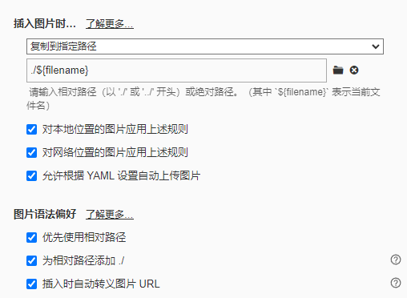
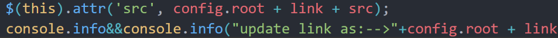
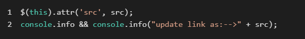

###

文档 : [hexo|文档](https://hexo.io/zh-cn/docs/)

<h5 id="Ddzce">hexo常用命令</h5>

:::info
hexo c //清除缓存

hexo g //生成静态资源

hexo s //本地部署预览

hexo d //云端部署

hexo new title //生成文章

:::

<h5 id="CCkF4"><font style="color:rgb(82, 95, 127);">解决方法</font></h5>

<font style="color:rgb(82, 95, 127);">可以通过修改配置并安装插件的方法完成图片的插入。你需要</font>**<font style="color:rgb(82, 95, 127);">修改站点配置</font>**`<font style="color:rgb(94, 102, 135);">_config.yml</font>`<font style="color:rgb(82, 95, 127);">，将 </font>`<font style="color:rgb(94, 102, 135);">post_asset_folder</font>`<font style="color:rgb(82, 95, 127);"> 设置为 </font>`<font style="color:rgb(94, 102, 135);">true</font>`

<font style="color:rgb(94, 102, 135);">这样在 hexo new xxx 会生成一个同名文件夹存放图片资源</font>

<font style="color:rgb(82, 95, 127);">然后安装插件：</font>

```plain
npm install hexo-asset-image -- save
```

<font style="color:rgb(82, 95, 127);">在 typora 中修改图片设置</font>



<font style="color:rgb(82, 95, 127);"> 如果你使用的是插件，当生成预览的时候，可能依旧无法正常查看图片。通过直接查看 HTML 文件，我们可以看到是因为多了 /.com/，所以在加载图片的时候无法获得正确的路径。</font>

<font style="color:rgb(82, 95, 127);">具体的修改也很简单，我们只需要到 </font>`<font style="color:rgb(94, 102, 135);">node_modules</font>`<font style="color:rgb(82, 95, 127);"> 中找到 </font>`<font style="color:rgb(94, 102, 135);">hexo-asset-image</font>`<font style="color:rgb(82, 95, 127);">，并将 58、89 行的</font>



<font style="color:rgb(82, 95, 127);">修改为</font>



<font style="color:rgb(82, 95, 127);">不出意外的话，就可以看到正常显示的图片了</font>
